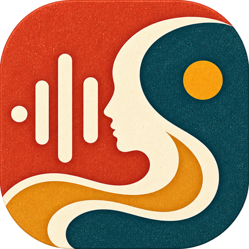
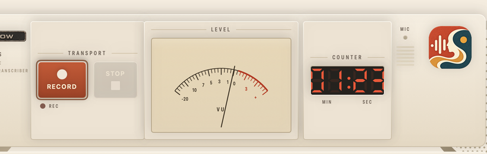
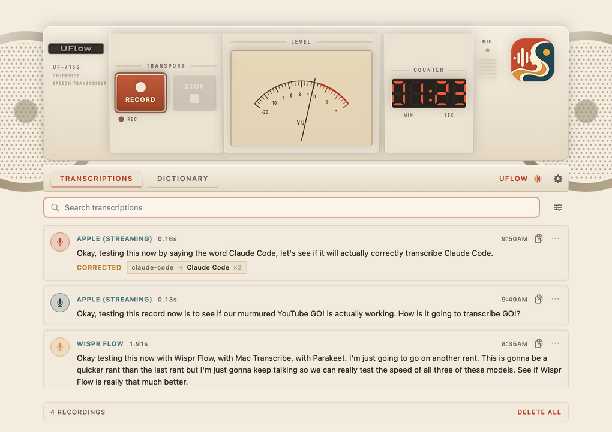
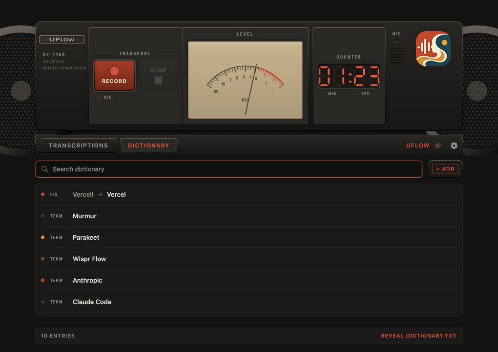

<p align="center">
  
</p>

<h1 align="center">UFlow</h1>

Dictation for macOS that looks like a boombox.
Press a key, talk, press it again. The text lands where your cursor was, instantly.

### Too broke for Wispr Flow? Same. That's the entire origin story.

**Free.** Not free-trial, not free-tier. There is nothing to subscribe to, no account to make, and no server to send your voice to, because there is no server.

**Fast.** The model runs on your Mac, not on somebody's GPU in Virginia. Transcription happens while you're still talking, so the text is already waiting when you stop. No upload, no queue, no spinner.

**[Download UFlow 1.0](https://github.com/Wasik-Yousha/UFlow/releases/latest)** · macOS 26+ · Apple Silicon · your voice never leaves the machine



## Why it looks like this

Every dictation app is a grey pill in the menu bar. I didn't want another one, so this is shaped like the stereo I grew up with.

The VU needle is real, by the way. It reads your actual mic level, with proper ballistics — fast attack, slow release — so quiet speech still moves it. Getting that to feel right took longer than the transcription did.

## Using it

Hit `Fn`+`Y` anywhere. A small recorder bar appears at the bottom of the screen:


Say your thing. Hit `Fn`+`Y` again. The bar goes away and your words get typed into whatever you were using — the email, the terminal, the text field. Not the clipboard. Where the cursor actually was.

If you'd rather see what you're doing, there's a window with the RECORD and STOP keys, and everything you've dictated:



Recordings started from the window go to the history instead of being typed somewhere, which is what you want when the app itself is focused.

## The dictionary

Here's the thing that actually made this usable for me.

Every dictation tool on earth writes **cloud code** when I say *Claude Code*. Every one. And *Anthropic* comes out as "anthropic", "entropic", or once, memorably, "and tropic".

So there's a dictionary:



You can add a word you want it to know (`Anthropic`), or a correction pair (`cloud code` → `Claude Code`). It does both, and it needs both. Feeding words to the speech engine before it listens makes it *lean* toward them, but that's a hint, not a promise. The find-and-replace pass afterwards is the part that actually guarantees anything.

The replace pass is fussier than it looks. `Claude Code` also catches `cloudcode`, `Cloud-Code` and `CloudCode`, because these models love gluing words together. But it will never touch `Cloudflare`, or the plain word `cloud`, because it requires the whole phrase. Longest match wins, one pass only, so rules can't cascade into each other and produce nonsense.

If you try to add an ordinary English word it'll warn you, because a rule for "the" would ruin your day.

When something gets corrected, the history tells you:

> **CORRECTED**  `claude-code → Claude Code ×2`

The dictionary is just a text file. Edit it in the app or in your editor, whichever:

```
~/Library/Application Support/UFlow/dictionary.txt
```

```
Anthropic
Claude Code
cloud code => Claude Code
!clawed code => Claude Code      # leading ! keeps an entry but turns it off
```

Switch back to the app and it re-reads the file.

## Installing it

Easiest way, and it skips the Gatekeeper nonsense entirely:

```sh
curl -fsSL https://raw.githubusercontent.com/Wasik-Yousha/UFlow/main/scripts/install.sh | bash
```

<details>
<summary>Why that's smoother than downloading the .dmg</summary>

<br>

macOS puts a quarantine flag on anything a browser downloads, and Gatekeeper won't open a quarantined app unless Apple has notarized it. Notarizing costs $99/year and I haven't paid it.

`curl` doesn't set that flag. Nothing is being defeated here — you ran the installer yourself — it just avoids a warning that only exists because of how the file arrived.

</details>

If you'd rather use the download button: grab the `.dmg`, drag UFlow to Applications, try to open it, get refused, Click Done.

⚠️ Not "Move to Trash" — Apple styles the destructive button green and makes it the visually obvious one.

Open System Settings → Privacy & Security

Scroll down to Security. There'll be a line saying "UFlow" was blocked to protect your Mac

Click Open Anyway, then authenticate

Launch UFlow again — it opens, and never asks again

Or skip all of that from a terminal:

```sh
curl -fsSL https://raw.githubusercontent.com/Wasik-Yousha/UFlow/main/scripts/install.sh | bash
```
### It'll ask for three permissions

| | Why it needs it |
|:--|:--|
| Microphone | To hear you. |
| Input Monitoring | To notice the hotkey while you're in another app. |
| Accessibility | To type the text where you were working. |

All three are load-bearing. Deny any one and something visibly breaks.

## Building it

No certificate needed:

```sh
git clone https://github.com/Wasik-Yousha/UFlow.git && cd UFlow
xcodebuild -project YouFlow.xcodeproj -scheme YouFlow -configuration Release \
           -derivedDataPath build/DerivedData CODE_SIGN_IDENTITY="-" build
cp -R build/DerivedData/Build/Products/Release/UFlow.app /Applications/
```

Or just open the project in Xcode and hit Run.

`./scripts/make-dmg.sh` packages a disk image. Debug builds also carry `--self-check`, which runs the correction engine against about a dozen cases that have all bitten me at some point, and `--dump-menu`, which prints the menu bar (added because I was convinced Settings had gone missing; it hadn't).

## How it was built

Built with a **DeepSeek harness** driving the **Ox Alpha** model through **[OpenRouter](https://openrouter.ai)**, and debugged with **[Claude Code](https://claude.com/claude-code)**.

<details>
<summary>Where things are</summary>

<br>

```
YouFlow/Sources/
  DesignTokens.swift          every visual value in the app
  DictationApp.swift          entry point, scenes, menus
  AppState.swift              coordinates a dictation session
  SpeechEngine.swift          Apple Speech + microphone capture
  TranscriptProcessor.swift   the dictionary's correction pass
  Persistence.swift           dictionary, history, settings
  HotkeyManager.swift         global event tap
  ClipboardInjector.swift     getting text into other apps
  HUDPanel.swift              the floating recorder bar
  DeckView.swift              the hardware deck
  MainWindowView.swift        window and tabs
  TranscriptionsView.swift    history
  DictionaryView.swift        the dictionary
  SettingsView.swift          hotkey, model, appearance
```

</details>

## What's not there yet

**macOS 26 or newer only.** The whole transcription path is Apple's `SpeechAnalyzer`, which doesn't exist before that. Making it run on older systems means a second engine, not a config flag — that's [issue #1](https://github.com/Wasik-Yousha/UFlow/issues/1), and it's in progress.

**English only**, because that's the locale the engine gets asked for.

**Not notarized**, see above.

**Apple Silicon.** Untested on Intel and probably not worth the effort.

---

Light and dark, switchable in Settings independently of the system:


---

<sub>Built with a DeepSeek harness driving the Ox Alpha model through OpenRouter · debugged with Claude Code</sub>
