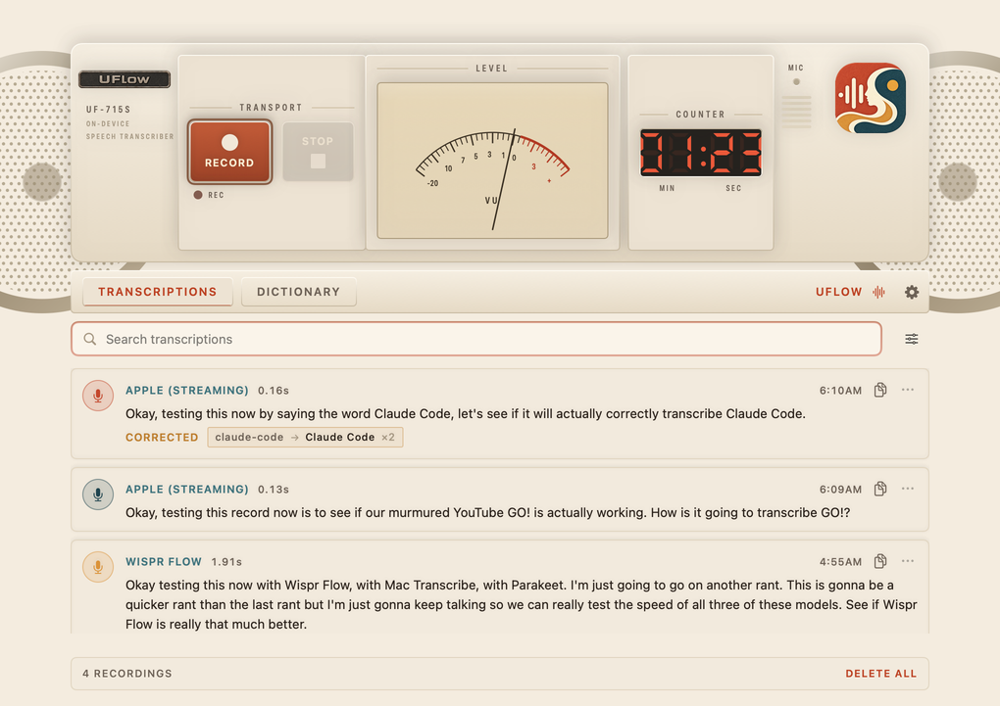
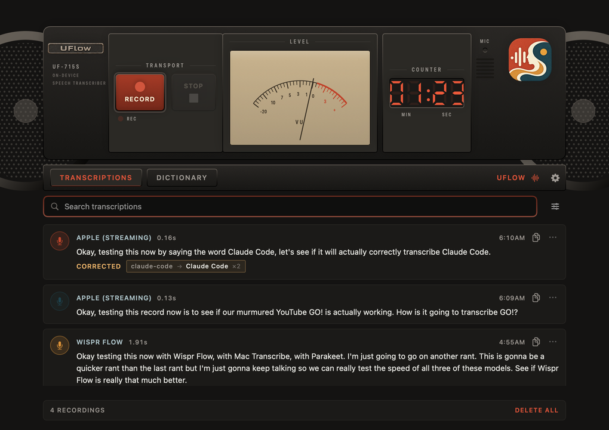

# UFlow

Push-to-talk dictation for macOS, styled as a 1990s portable cassette deck.
Hold a key anywhere, talk, tap again — the text is typed into whatever app you
were already in. Everything runs on-device.



<details>
<summary>Dark</summary>


</details>

## What it does

- **Global hotkey.** Fn + Y by default, configurable. Tap to start, tap to stop.
  Works in any app; the transcript is typed where you were.
- **On-device transcription** via Apple's Speech framework. Nothing leaves the Mac.
- **A dictionary** for names, jargon and product names it keeps getting wrong.
- **History** — searchable, with copy on every entry, and a record of what the
  dictionary changed.
- **A floating recorder bar** while you dictate into another app, with a live
  level meter and elapsed time.
- Light and dark, switchable in Settings independently of macOS.

## The dictionary

Two kinds of entry:

| Kind | Example | What it does |
|---|---|---|
| **Term** | `Anthropic` | A word it should know. Fed to the speech engine as a hint, and its spelling is enforced afterwards. |
| **Fix** | `cloud code => Claude Code` | When you hear X, write Y. |

Both halves matter. Biasing the engine is a nudge, not a promise; the
correction pass afterwards is the guarantee.

Corrections are whole-word, case-insensitive, longest-match-first, in a single
pass so rules can't cascade. The separator between words of a phrase is
elastic, because these models glue words together — `cloud code` also catches
`cloudcode`, `Cloud-Code` and `CloudCode`. A phrase never matches part of
another word, so `Claude Code` leaves `Cloudflare` and the ordinary word
`cloud` alone. Adding a single ordinary English word warns you before it saves.

The dictionary lives at:

```
~/Library/Application Support/UFlow/dictionary.txt
```

It is plain text and hand-editable — UFlow re-reads it when you switch back to
the app. History is `transcripts.json` in the same folder.

```
# One entry per line.
Anthropic
Claude Code
cloud code => Claude Code
!clawed code => Claude Code     # a leading ! keeps an entry without applying it
```

## Requirements

- macOS 26 or later
- Xcode 26 or later (to build)

## Build from source

No certificate needed — ad-hoc signing is enough to run it locally:

```sh
git clone <your-fork-url> && cd YouFlow
xcodebuild -project YouFlow.xcodeproj -scheme YouFlow -configuration Release \
           -derivedDataPath build/DerivedData \
           CODE_SIGN_IDENTITY="-" build
cp -R build/DerivedData/Build/Products/Release/UFlow.app /Applications/
```

Or open `YouFlow.xcodeproj` in Xcode, set Signing to your own team (or
"Sign to Run Locally"), and hit Run.

To package a disk image:

```sh
./scripts/make-dmg.sh      # -> dist/UFlow-1.0.dmg
```

To cut a release once the repo exists:

```sh
./scripts/make-dmg.sh
gh release create v1.0 dist/UFlow-1.0.dmg \
   --title "UFlow 1.0" \
   --notes "Install: curl -fsSL https://raw.githubusercontent.com/OWNER/REPO/main/scripts/install.sh | bash"
```

### Permissions

On first launch macOS will ask for three things. All are required:

| Permission | Why |
|---|---|
| **Microphone** | To hear you. |
| **Input Monitoring** | To see the global hotkey while another app is focused. |
| **Accessibility** | To type the transcript into the app you were using. |

These are tied to the app's code signature. Rebuilding with a *different*
signing identity makes macOS treat it as a new app, and you will be asked
again — remove the stale entry in System Settings ▸ Privacy & Security if it
starts refusing.

## Install

**One line, no warnings:**

```sh
curl -fsSL https://raw.githubusercontent.com/OWNER/REPO/main/scripts/install.sh | bash
```

This downloads the latest release, installs it to `/Applications`, and opens
it. macOS attaches a quarantine flag to *browser* downloads and Gatekeeper
refuses to open an app carrying one unless Apple has notarized it — `curl`
does not set that flag, so this route just works.

**Or download the `.dmg`** from the Releases page and drag UFlow to
Applications. That path *does* get quarantined, so see below.

## Opening a downloaded .dmg

UFlow is signed with a self-signed certificate rather than an Apple Developer
ID, and it is not notarized, so a browser-downloaded copy is blocked on first
open. The image ships a `Read Me First.txt` saying the same thing. Two ways
past it:

**Either** — try to open UFlow once, then go to **System Settings ▸ Privacy &
Security**, scroll down, and click **Open Anyway** next to the message about
UFlow.

**Or** — clear the quarantine flag yourself:

```sh
xattr -dr com.apple.quarantine /Applications/UFlow.app
```

On recent macOS versions right-click ▸ Open no longer works for unnotarized
apps, so use one of those two — or the `curl` line above, which avoids the
situation entirely.

To remove this friction properly you need an
[Apple Developer Program](https://developer.apple.com/programs/) membership
(currently $99/year), which gets you a Developer ID certificate. Then sign and
notarize:

```sh
codesign --force --deep --options runtime \
         --entitlements YouFlow/Sources/YouFlow.entitlements \
         --sign "Developer ID Application: YOUR NAME (TEAMID)" /Applications/UFlow.app
xcrun notarytool submit dist/UFlow-1.0.dmg --keychain-profile "AC_PASSWORD" --wait
xcrun stapler staple dist/UFlow-1.0.dmg
```

After that the `.dmg` opens on any Mac with no warnings.

## Design

The interface is built from a single token file —
[`YouFlow/Sources/DesignTokens.swift`](YouFlow/Sources/DesignTokens.swift).
Colour, type scale, spacing, corner radius, stroke, shadow, motion and sound
all live there, and views pull from `Tok.*` rather than inlining values. The
brand palette is sampled from the app icon; the chassis and instrument colours
are sampled from the design references.

`UFlow-Design-Tokens.html` at the repo root is a readable sheet of the whole
system, including a live level meter for tuning the needle ballistics.

## Layout

```
YouFlow/Sources/
  DesignTokens.swift      the design system — every visual value
  DictationApp.swift      app entry, scenes, menus
  AppState.swift          session coordinator
  SpeechEngine.swift      Apple Speech + microphone capture
  TranscriptProcessor.swift   the dictionary's correction pass
  Persistence.swift       dictionary, history, settings
  HotkeyManager.swift     global event tap
  ClipboardInjector.swift text injection
  HUDPanel.swift          the floating recorder bar
  DeckView.swift          the hardware deck
  MainWindowView.swift    window, tabs
  TranscriptionsView.swift / DictionaryView.swift / SettingsView.swift
```

Debug builds carry two self-checks:

```sh
UFlow.app/Contents/MacOS/UFlow --self-check   # correction engine + dictionary round trip
UFlow.app/Contents/MacOS/UFlow --dump-menu    # prints the menu bar
```

## Note on the reference folder

`reference/` is a third-party checkout kept locally for comparison and is
excluded from the repository.
